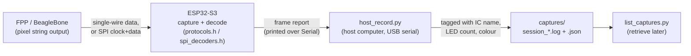
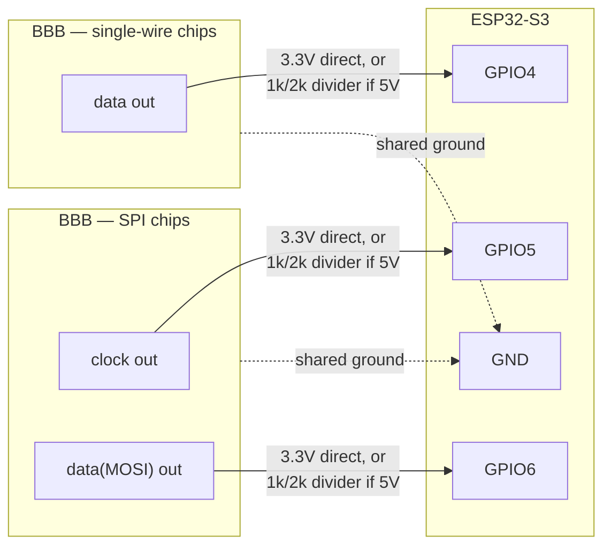
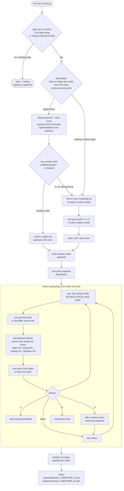
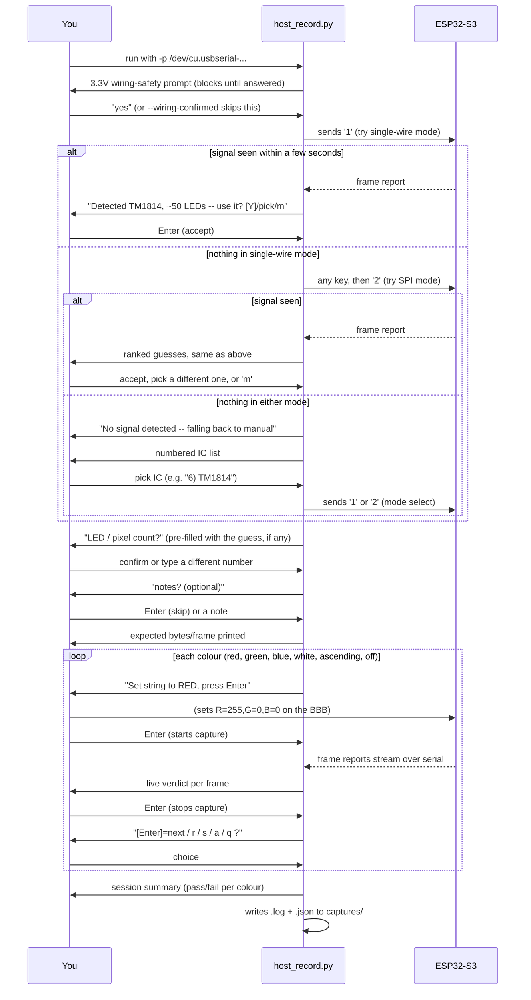

# ESP32-S3 LED Signal Analyzer

Two capture modes, selected over serial at boot:

- **[1] Single-wire** (RMT RX) — WS281x family, TM1814/TM1829/TM1914 (inverted),
  UCS7604, UCS8903/8904 (16-bit), WS2805, SM16825E. Reports polarity, T0/T1H/period,
  classifies the capture against this session's library-consensus tolerance windows
  (`protocols.h`), and scans the decoded bytes for known preamble/trailer signatures
  (TM1814/TM1914/UCS7604 preambles, the SM16825E current-gain trailer).
- **[2] SPI/clocked** (GPIO interrupt) — APA102/SK9822/HD107S, WS2801, P9813,
  SM16716/SM16726. Reports the raw stream and checks it against every known frame
  shape (only the real chip's will look sane).

Built to close the loop this session's `fpp-bbb-pixels`/`SPIPixels` work left open:
the TM1814/TM1829/TM1914 **inverted waveforms have never been watched on a scope**,
and the P9813/SM16716 SPI framing fixes have never been checked against a real
capture either — nothing about correctness in software changes that.



## Dependencies

**Firmware (the ESP32 sketch): zero third-party Arduino libraries.** Every
`#include` across `esp32-led-analyzer.ino`/`protocols.h`/`capture_singlewire.h`/
`capture_spi.h`/`spi_decoders.h` is either a local project header, a standard C
header (`stdint.h`, `string.h`), or `driver/rmt_rx.h` — which ships as part of
the ESP32 board package itself, not a separate Library Manager install.

The only thing to actually install:
- **Arduino IDE → Boards Manager → search "esp32" → install the Espressif
  `esp32` package, core version 3.0.0 or newer.** That version bundles the
  IDF 5 RMT RX driver `capture_singlewire.h` uses; older cores don't have it
  and the single-wire mode won't compile. Verified in this session against
  core **3.3.3**.
- If Boards Manager doesn't already list it, add this URL under
  **Preferences → Additional Boards Manager URLs** first:
  `https://raw.githubusercontent.com/espressif/arduino-esp32/gh-pages/package_esp32_index.json`
- Board selection: any **ESP32-S3** entry (e.g. "ESP32S3 Dev Module"). The
  RMT RX peripheral and DMA-backed capture buffer this sketch relies on are
  S3-specific — plain ESP32/S2/C3 boards are not a drop-in swap.

**Host-side recording script (`host_record.py`, optional):** Python 3 +
[pyserial](https://pypi.org/project/pyserial/). Set up once from this
directory:
```bash
python3 -m venv .venv
.venv/bin/pip install pyserial
```
Nothing else — no GitHub/network libraries, `host_record.py` only opens a
local serial device and writes local files (see "Recording captures" below).

## Wiring ⚠️ read first
ESP32-S3 GPIO is **3.3 V and NOT 5 V tolerant** on every pin below — this is
a hard voltage-rating limit, not something firmware or host-side code can
compensate for. **You do not need a commercial level-shifter module for
this**, though — cheapest option first:

1. **Tap a 3.3V-logic point instead, if one exists.** Some BBB cape designs
   drive the pixel port through their own onboard 5V buffer/level-shifter
   chip (e.g. a 74HCT245) — if yours does, the PRU/GPIO pin *before* that
   chip is often still exposed and is native 3.3V logic already, needing no
   extra parts at all. Check your board's schematic/silkscreen.
2. **A 2-resistor divider — no chip, no module, ~$0.02 in parts.** This is
   the default assumption below and in the tool's own safety prompt.
3. **A real level-shifter module** (74HCT245, TXB0108, etc.), if you happen
   to have one — functionally equivalent to (2) for this purpose, no better.

```
   5V source ──1kΩ──┬── ESP32-S3 GPIO pin (sees ~3.3V)
                     │
                    2kΩ
                     │
                    GND
```
The divider drops a 5V swing to `5V × 2kΩ/(1kΩ+2kΩ) ≈ 3.33V` — inside the
GPIO's safe input range with margin. Exact resistor values aren't critical;
any pair in roughly a 1:2 ratio (1k/2k, 10k/20k, whatever's in a junk-drawer
kit) works the same way. If your source is already 3.3V logic (common when
tapping before a buffer chip, or on some native-3.3V BBB setups), skip the
divider entirely — it's not needed and doesn't hurt, either.

| Mode | Pin | Source |
|---|---|---|
| Single-wire | data → `GPIO4` | 3.3V direct, or divided/shifted down from 5V per above |
| SPI | clock → `GPIO5`, data(MOSI) → `GPIO6` | same rule |

Always share **ground**. Pin numbers are `#define`s at the top of
`capture_singlewire.h` / `capture_spi.h` if you need to change them.

**The tool won't let you skip this by accident:** every run of
`host_record.py` (guided or `--freeform`) opens with a wiring-safety prompt
that requires typing `yes` before it touches the serial port at all — pass
`--wiring-confirmed` to skip it on repeat runs once you've verified your
setup. The firmware's own boot menu prints the same reminder every time it
returns to the menu, regardless of which tool is talking to it.



**SPI mode's real limit:** this is a GPIO-interrupt bit-bang capture, not a
hardware SPI receiver — reliable to roughly **200-500 kHz**, not the 1-20 MHz
these chips actually run at. Frame *content* doesn't depend on clock speed, only
signal integrity does, so **temporarily lower `spiSpeed`** in your SPIPixels
output config (e.g. to `200000`) while verifying framing here, then restore your
normal speed once it checks out.

## Testing off-target

`protocols.h` and `spi_decoders.h` have no real hardware dependency beyond a
printf-capable `Serial`-like object, so they compile and run natively on a
Mac/Linux dev machine — no ESP32 needed. `test_native/` does exactly that:
a `HardwareSerial` stub plus two suites feeding known values through the
*actual* classifier/decoder code, not a reimplementation of it.

```bash
cd test_native
c++ -std=c++17 -Wall -Wextra -fsanitize=address,undefined -I.. test_protocols.cpp -o /tmp/tp && /tmp/tp
c++ -std=c++17 -Wall -Wextra -fsanitize=address,undefined -I.. test_spi_decoders.cpp -o /tmp/ts && /tmp/ts
```

- `test_protocols.cpp`: every timing profile matches its own reference
  midpoint, window boundaries are exact (inclusive edges match, one ns
  outside doesn't), every preamble/trailer signature is detected at its
  correct position (and *not* at the wrong one), the UCS7604 CFG byte
  decodes correctly, and a no-match capture reports nearest candidates
  instead of silence. Also documents a real, non-obvious finding: TM1814's
  and TM1829's timing windows genuinely overlap (both are Titan-family
  inverted chips with close datasheet numbers) — timing alone can't always
  tell them apart, which is exactly why the signature scan exists.
- `test_spi_decoders.cpp`: round-trips the exact known-good vectors from
  `plugins/SPIPixels/tests/test_format.cpp` through `spi_check_apa102` /
  `spi_check_p9813` / `spi_check_ws2801`, confirms the P9813 end-frame
  length fix scales correctly past 64px, and checks every decoder handles
  an empty/too-short capture without an out-of-bounds read (run under
  ASan/UBSan, not just eyeballed). Also caught a real bug this way: the
  APA102 decoder's pixel-walk couldn't structurally distinguish a genuine
  white pixel from the trailing all-`0xFF` end frame (both match the same
  top-3-bits pattern) and was greedily consuming the end frame as an extra
  "pixel" — fixed by backtracking off a trailing all-`0xFF` run only when
  the walk consumed every remaining byte.
- Neither suite proves the RMT/GPIO *capture* itself is correct on real
  hardware — only that the analysis logic downstream of a capture is. That
  still needs a real ESP32 and a real signal.

## Build & flash
**Arduino IDE:** install the *esp32* boards package (Boards Manager, core
**3.0.0+** — bundles the IDF 5 RMT driver). Select an ESP32-S3 board, open
`esp32-led-analyzer.ino`, upload.

**arduino-cli** (verified against core 3.3.3):
```bash
arduino-cli core install esp32:esp32          # need >=3.0.0
arduino-cli compile -b esp32:esp32:esp32s3 esp32-led-analyzer
arduino-cli upload  -b esp32:esp32:esp32s3 -p /dev/ttyACM0 esp32-led-analyzer
arduino-cli monitor -p /dev/ttyACM0 -c baudrate=115200
```
Send `1` or `2` over serial to pick a mode; any key returns to the menu.

## Recording captures for later analysis

The sketch itself only prints reports over serial — nothing survives past the
terminal scrollback unless you capture it. `host_record.py` (host-side, no
firmware changes) taps that same serial stream. Its **default mode is a
guided, interactive session**, not passive recording:

```bash
.venv/bin/python3 host_record.py --list                      # find the port
.venv/bin/python3 host_record.py -p /dev/cu.usbserial-0001
```

It prompts you through the whole test, and stores exactly what you tell it
alongside every frame it captures — so a recording answers "what IC, how
many LEDs, what colour" on its own later, instead of you having to remember
or reverse-engineer it from a raw byte dump.

**Before it even asks, it listens.** By default the very first thing that
happens is a short auto-detect sniff: the tool tries single-wire mode, then
SPI mode, and if a real frame shows up in either it runs the same
timing/signature/byte-count logic the pass/fail checks already use — just
run *backwards*, from "what did we see" to "what IC and LED count would
produce that" — and suggests a ranked guess instead of an empty prompt. You
still confirm or correct it; nothing is ever auto-accepted. See
"Auto-detect" below for exactly how the guess is scored and what it looks
like when it's wrong or ambiguous.



Default colour sequence is red → green → blue → white/extra-channel → an
ascending R/G/B/W pattern → off — one channel isolated at a time, so a wiring
or colour-order mistake shows up as "red channel is empty" instead of a wall
of ambiguous bytes.

Same session, shown as who-does-what over time — three actors, not two: you,
the host tool, and the ESP32 itself:



**What it actually looks like on screen** — a real (abbreviated) transcript, exactly as printed, for a 50-pixel TM1814 string that was already plugged in and driving a test pattern when the tool started. `-->` marks where you type something and press Enter; everything else is what the tool prints:

```
!!!!!!!!!!!!!!!!!!!!!!!!!!!!!!!!!!!!!!!!!!!!!!!!!!!!!!!!!!!!!!!!!!!!!!
! ESP32-S3 GPIO is 3.3V ONLY. A bare 5V data/clock line WILL damage it.
! You do NOT need a commercial level-shifter module for this -- any
! one of these is enough, cheapest first:
!   1) Tap a 3.3V-logic point in the signal chain instead, if your
!      cape/board exposes the driver's output BEFORE its own 5V
!      buffer chip (check your board's schematic/silkscreen).
!   2) A 2-resistor divider: 1k from the source to the GPIO pin,
!      2k from that same pin to GND. ~$0.02 in parts, no chip needed.
!   3) A real level-shifter module (74HCT245, TXB0108, etc.) if you
!      have one -- functionally equivalent to (2) for this purpose.
! Wiring 5V straight into GPIO4/5/6 with none of the above WILL risk
! frying the board. See the README's Wiring section for details.
!!!!!!!!!!!!!!!!!!!!!!!!!!!!!!!!!!!!!!!!!!!!!!!!!!!!!!!!!!!!!!!!!!!!!!
Type 'yes' to confirm your signal is 3.3V-safe (shifted, divided, or
already 3.3V logic) and continue: --> yes

=== Guided capture session ===

Listening for a signal (3s per mode, single-wire then SPI)...

Detected a signal in single-wire mode.
  Best guesses (ranked -- confirm before recording, this is not certain):
    1) TM1814, ~50 LEDs
    2) UCS8904 (16-bit RGBW), ~26 LEDs
  [Enter]=use #1, or a number, or m=manual picklist: --> [Enter]
LED / pixel count in the test string [50]: --> [Enter]
Session notes (optional, Enter to skip): --> bench test, TM1814 string #2

Already listening in single-wire mode from auto-detect -- continuing without re-selecting.
Expecting 208 bytes/frame for 50x TM1814 (8 preamble + 4*50 pixel + 0 trailer).

==> Set the TM1814 string to RED (R=255,G=0,B=0,W=0) on the BBB, then press Enter to start capturing.
--> [Enter]
  Capturing 'red'... press Enter again once you've seen enough frames.
    frame: bytes 208/208 OK | timing OK | polarity OK | signature OK
    frame: bytes 208/208 OK | timing OK | polarity OK | signature OK
--> [Enter]
  -> 2 frame(s) captured, 2/2 matched expectations.
  [Enter]=next colour, r=repeat this colour, s=skip remaining defaults, a=add a custom colour, q=end session: --> [Enter]

==> Set the TM1814 string to GREEN (R=0,G=255,B=0,W=0) on the BBB, then press Enter to start capturing.
--> [Enter]
  Capturing 'green'... press Enter again once you've seen enough frames.
    frame: bytes 208/208 OK | timing OK | polarity OK | signature OK
--> [Enter]
  -> 1 frame(s) captured, 1/1 matched expectations.
  [Enter]=next colour, r=repeat this colour, s=skip remaining defaults, a=add a custom colour, q=end session: --> [Enter]

       ... (blue, white/extra-channel, ascending, off — same pattern) ...

============================================================
Session summary: TM1814  (50 LEDs, single-wire)
  red                    2/2 frames  OK
  green                  1/1 frames  OK
  blue                   1/1 frames  OK
  white/extra-channel    1/1 frames  OK
  ascending              1/1 frames  OK
  off                    1/1 frames  OK
Saved: captures/session_20260826_141502_TM1814.log
        captures/session_20260826_141502_TM1814.json
```

**Reading a live verdict line** — this is the part you're actually watching during
capture, so here's what each field means and what a real failure looks like:

```
    frame: bytes 208/208 OK | timing OK | polarity OK | signature OK
            └──┬──┘          └───┬───┘   └────┬────┘   └─────┬─────┘
         got vs. expected     matched      idle-HIGH/     preamble/trailer
         byte count for       protocols.h's LOW polarity   byte pattern
         this IC+LED count    timing window matched what   found where
                               (per protocols.h)  the IC expects  expected

  Example FAIL — wrong LED count entered, or a wiring/colour-order bug:
    frame: bytes 158/208 MISMATCH | timing OK | polarity OK | signature OK
                          ^^^^^^^^ fewer bytes arrived than the IC+LED count predicts

  Example FAIL — inverted chip wired/decoded as non-inverted (or vice versa):
    frame: bytes 208/208 OK | timing NO MATCH | polarity WRONG | signature OK
                                        ^^^^^^^^         ^^^^^ both point at the same root cause
```

0. **Auto-detect** (default, on by default): the tool listens for a real
   signal before asking you anything. See "Auto-detect: how the guess is
   made" below for exactly what it does and doesn't know.
1. **Pick the IC** — if auto-detect found nothing, you declined its guess
   (`m`), or you ran with `--no-detect`: a numbered list (mirrors
   `protocols.h`'s timing profiles and `spi_decoders.h`'s SPI chips — see
   `ic_catalog.py`) or type a custom name. This also auto-sends `1`/`2` to
   the device to select the right capture mode — one less manual step.
2. **Enter/confirm the LED-pixel count** in your test string (pre-filled
   with auto-detect's guess when it has one). Combined with the IC's known
   preamble/trailer/bytes-per-pixel, the script computes the *expected*
   byte count up front and checks every captured frame against it.
3. **Cycle through colours**, one at a time: it tells you what to set on the
   BBB (`R=255,G=0,B=0` etc.), waits for Enter once you've set it, then
   captures until you press Enter again. Every frame captured during that
   window gets a live one-line verdict:
   ```
       frame: bytes 16/16 OK | timing OK | polarity OK | signature OK
   ```
   Default sequence is red → green → blue → white/extra-channel → an
   ascending R/G/B/W pattern → off, matching the single-channel-isolation +
   ascending-pattern advice from earlier in this session — but at each
   colour you can `r`epeat, `s`kip the rest, `a`dd a custom colour, or `q`uit
   early.
4. **Colour order check** (single-wire only, skipped if the session was
   interrupted): once red/green/blue (and white, for 4-channel ICs) have
   been captured, the tool already knows both what channel you set on the
   BBB *and* which wire byte position actually lit up brightest for it — so
   it can work out the wire order (e.g. `GRB` vs `RGB`) directly, no
   firmware change needed. It always asks before recording anything:
   ```
   Inferred wire colour order from the red/green/blue captures: GRB
     Is GRB correct? [Y]es / n=let me correct it / s=skip, don't record:
   ```
   `n` lets you type the real order yourself if the guess is wrong; either
   way nothing is written to the session unless you confirm or correct it.
   If the captures were too ambiguous to say anything (dim/near-tied bytes,
   two colours pointing at the same position), it says so and moves on
   rather than guessing blind — see `color_analysis.py` for exactly what
   counts as "clean enough" evidence.
5. **Session summary** at the end: pass/fail per colour (and the confirmed
   colour order, if any), then both files are written —
   `captures/session_<timestamp>_<ic>.log` (the same human-readable
   per-line-timestamped format as before) *and* `.json` (structured: IC name,
   LED count, notes, colour order, and every segment's intended colour +
   parsed frames — see `frame_parser.py` for exactly what gets extracted
   from each report).

**Auto-detect: how the guess is made, and its real limits.** It tries
single-wire mode first, listens for a few seconds (`--detect-seconds`,
default 3), and if nothing shows up switches to SPI mode and tries again.
Once a real frame arrives, `ic_catalog.py`'s `guess_ics()` scores every
catalog entry against it:
- **Single-wire:** a preamble/trailer signature match is strong evidence
  (TM1814/TM1914/UCS7604/SM16825E carry one); a timing-profile match alone
  is weaker, since some families genuinely overlap — TM1814 and TM1914
  share identical wire timing (only their preamble differs), and TM1829's
  window overlaps both (see `test_native/test_protocols.cpp`'s documented
  finding); and the byte count either divides evenly into that IC's
  preamble+trailer+bpp shape or it doesn't, which is enough to rule out
  most wrong guesses even when timing alone can't.
- **SPI:** the firmware already runs *every* known chip's framing check
  against *every* capture (that's the whole design — see `spi_decoders.h`),
  so detection just reads which block came back cleanest and pulls the LED
  count straight out of its own "pixel frames found" line — no separate
  arithmetic needed.
- **It can be wrong.** A floating/unwired pin can still produce a "frame"
  out of electrical noise, and closely-related chips can legitimately tie.
  That's why it's always a ranked list you confirm, pick from, or reject
  (`m` for the manual picklist) — never an auto-accept. Skip the sniff
  entirely with `--no-detect` if you'd rather always pick by hand.

**Retrieving recordings later** — `list_captures.py` reads the `.json`
sidecars, no need to open files by hand:
```bash
python3 list_captures.py                  # every session, newest first
python3 list_captures.py --ic TM1814       # just that IC
python3 list_captures.py --failed          # only sessions with a failing colour
python3 list_captures.py --show <session_id>   # full per-frame detail
```

**The old passive mode still exists** for ad-hoc capture that doesn't fit
the guided IC/colour structure (e.g. just watching what comes out while
debugging something unexpected):
```bash
.venv/bin/python3 host_record.py -p /dev/cu.usbserial-0001 --freeform --label whatever
```

**Why host-side, not on-device:** the analyzer is always tethered over USB
during a capture session — that's how you send it `1`/`2` in the first place
— so host-side capture gets "record everything, structured, retrievable"
for free with no added firmware complexity and, deliberately, no WiFi
credentials or API tokens living on a physical device that could be lost or
compromised.

**Where captures live:** `captures/` in this directory, tracked in this
folder's own git repo so a capture's history is versioned alongside the
exact tool code that produced it — and backed up to
[joeskolengaden/esp32-led-analyzer](https://github.com/joeskolengaden/esp32-led-analyzer) on GitHub.
Nothing leaves this machine automatically; recording writes local files
only. When you have a batch of sessions worth keeping:
```bash
git add captures/
git commit -m "captures: <what you were checking>"
git push
```

## Verification workflow
1. **Sanity check** with a known-good chip first (e.g. plain WS2811 from a
   reference generator). Drive a fixed pattern, confirm the printed bytes match
   and the timing classifies as expected.
2. **Capture a reference** device's output for the chip under test — record the report.
3. **Capture the BBB's output**: configure that chip in FPP (Pixel Timing preset
   + color order per CONFIG.md), output the *same* pattern, feed it in.
4. **Compare:** polarity, timing-profile match (or how far off if it doesn't
   match), signature match on any preamble/trailer, and identical byte streams.

**Priority order for this session's open items** — check these first:
1. **TM1814/TM1829/TM1914 inverted waveform** (single-wire mode): confirm
   `polarity: INVERTED` prints, timing classifies into the matching profile, and
   the preamble signature matches (TM1814/TM1914 only — TM1829 has no preamble).
2. **UCS7604 preamble + CFG byte** (single-wire mode): confirm the 8-byte sync
   signature matches and the CFG byte decodes to the bit depth you configured.
3. **SM16825E trailer** (single-wire mode): confirm it appears at the *end* of
   the frame (not the start) and matches the shipped default (or your edited `g`).
4. **P9813 end-frame length past 64px** and **SM16716 bit framing** (SPI mode):
   confirm the pixel-frame count matches what you configured and, for P9813 with
   >64 pixels, that the end/latch byte count actually grew.

## What "MATCH" means
Timing windows in `protocols.h` are **library-consensus** windows (what a
correctly-working implementation actually emits, cross-checked against FastLED/
NeoPixelBus/WLED in this session's earlier research) — not raw datasheet min/max.
A datasheet-strict checker would false-flag a correctly working BBB. If nothing
matches, the tool prints the closest candidates and how far off (as a percentage)
so you can tell "slightly marginal" from "wrong chip."
